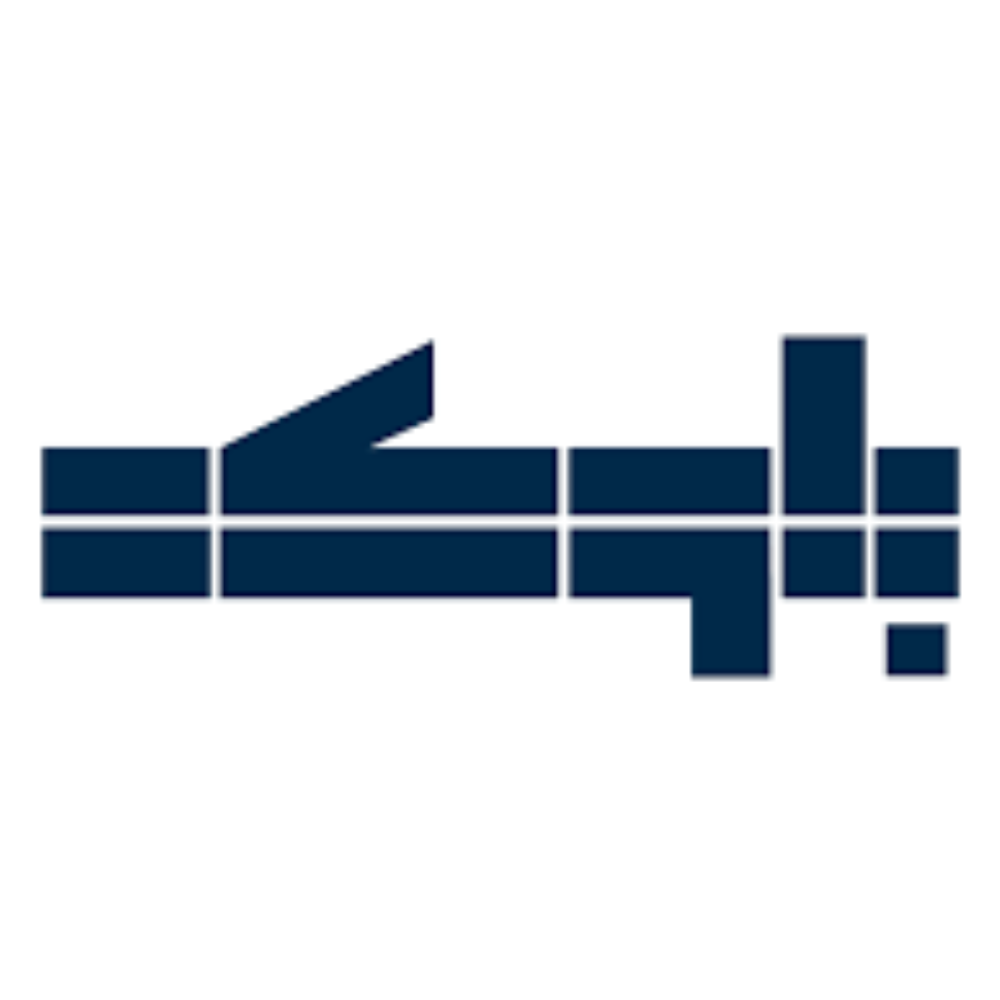
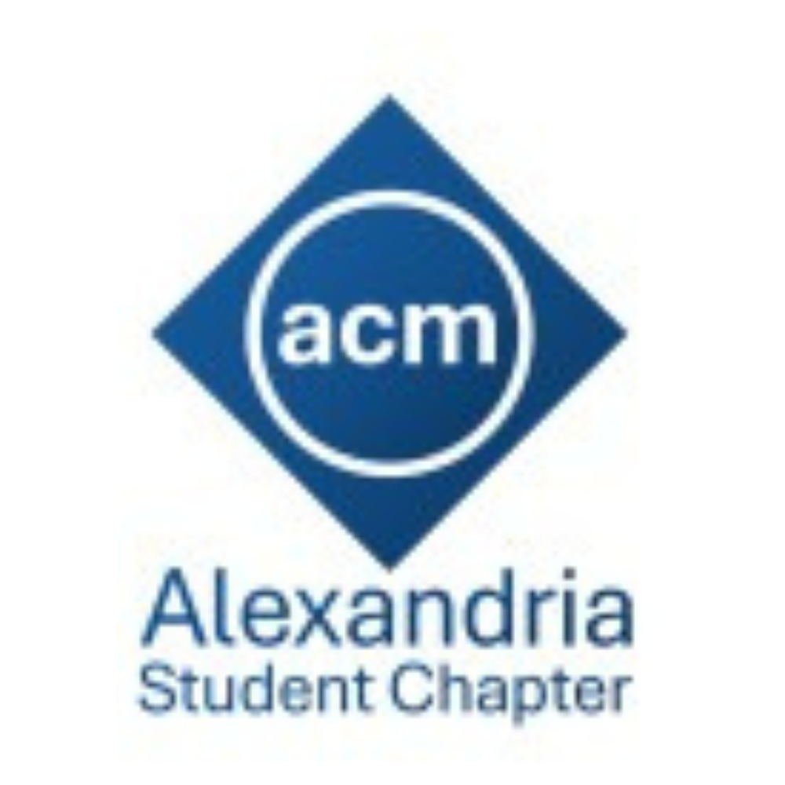
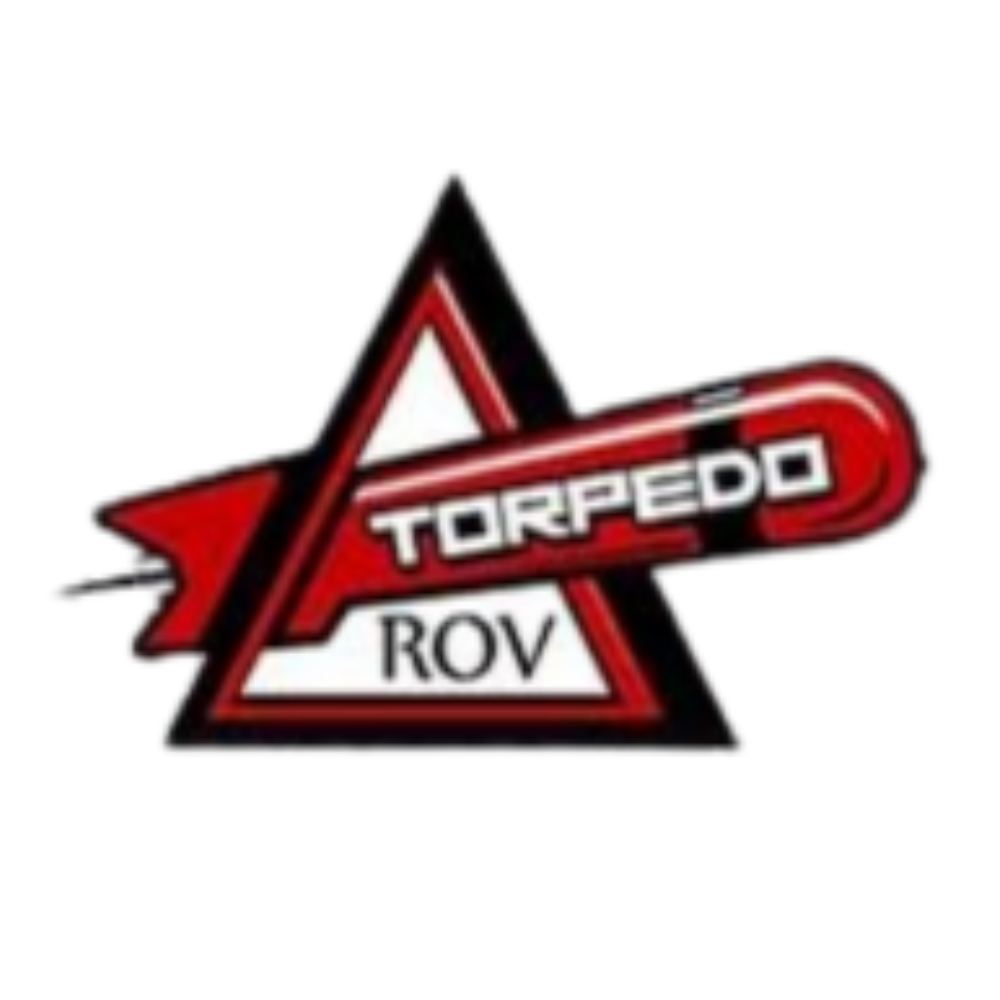
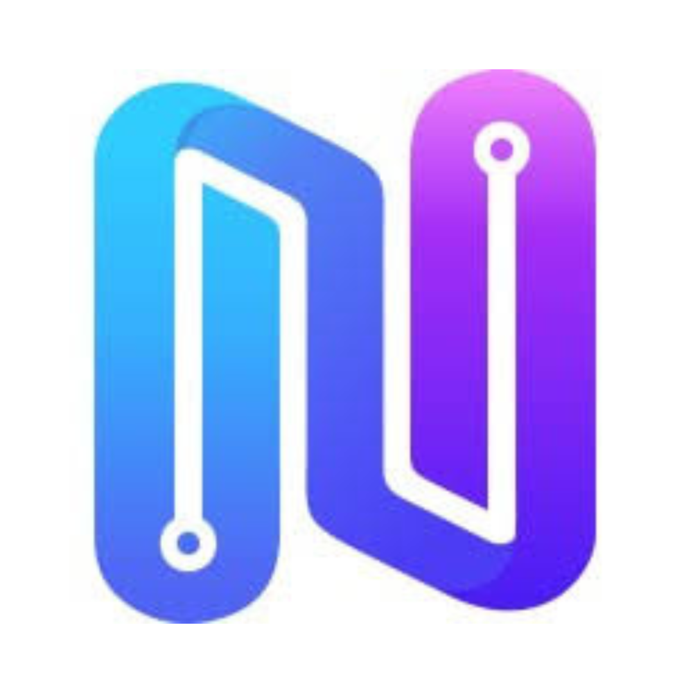
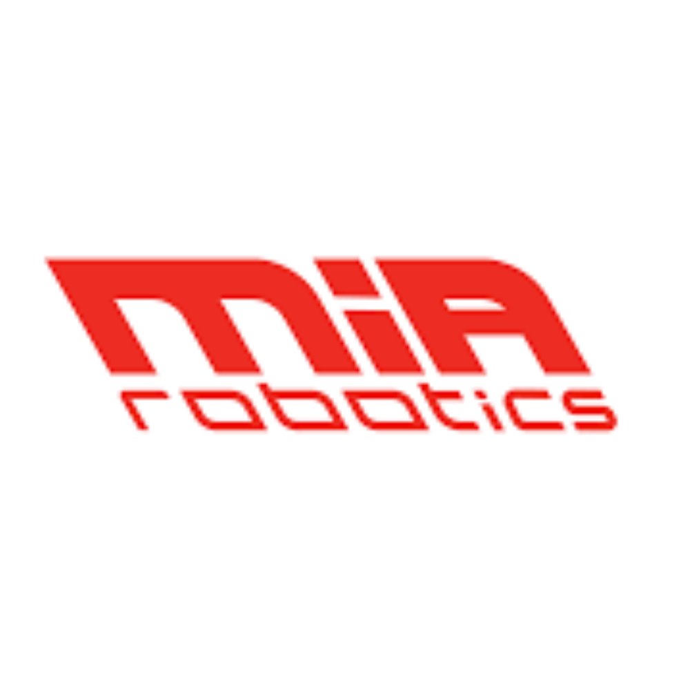

    <h1>
        Hello World, I am Abdelrahman Sharaf 👋🏻
    </h1>
    

        A Passionate Software Engineer from Egypt.
    

    <h2>
        Connect with Me
    </h2>
    

        
        
    

    <h2>
        Professional Journey
    </h2>
    
    

        

            <h3>Pathways</h3>
        

        <table width="100%" align="center">
            <!-- Blokkah -->
            <tr width="100%">
                <td valign="center" align="center" width="120px">
                    
                </td>
                <td valign="center" align="left">
                    

                        
Frontend Engineer

                        

                            <a href="https://www.linkedin.com/company/blokkah-app/">Blokkah Real Estate Platform</a> —
                            Remote
                        

                        

                            PropTech Startup in Saudi Arabia
                        

                        

                            <b>June 2023 - Present</b> · Part-Time 
                        

                    

                </td>
            </tr>
            <!-- ACM Alexandria Student Chapter -->
            <tr width="100%">
                <td valign="center" align="center" width="120px">
                    
                </td>
                <td valign="center" align="left">
                    

                        
Public Relations Volunteer
                        

                        

                            <a href="https://www.linkedin.com/company/alexacm/">ACM Student Chapter</a> — Hybrid
                        

                        

                            Oldest ACM Student Chapter and Winner of ACM Excellence Awards
                        

                        

                            <b>Aug 2024 - Present</b>
                        

                    

                </td>
            </tr>
            <!-- Torpedo ROV -->
            <tr width="100%">
                <td valign="center" align="center" width="120px">
                    
                </td>
                <td valign="center" align="left">
                    

                        
Head of AI Sub-Team

                        

                            <a href="https://www.linkedin.com/company/torpedorov/">Torpedo ROV</a> — On-site
                        

                        

                            Underwater Robotics Team Competes in Prestigious Competitions like MATE ROV
                        

                        

                            <b>Jul 2024 - Present</b>
                        

                    

                </td>
            </tr>
            <!-- NeuralSeek -->
            <tr width="100%">
                <td valign="center" align="center" width="120px">
                    
                </td>
                <td valign="center" align="left">
                    

                        
Global AI Agent Builder Intern
                        

                        

                            <a href="https://www.linkedin.com/company/neuralseek/">NeuralSeek</a> — Remote
                        

                        

                            No-code platform orchestrating LLM-based AI agents with governance, human review,
                            observability, and integrations
                        

                        

                            <b>Oct 2025 - Nov 2025</b> · Internship 
                        

                    

                </td>
            </tr>
            <!-- M.I.A. Robotics -->
            <tr width="100%">
                <td valign="center" align="center" width="120px">
                    
                </td>
                <td valign="center" align="left">
                    

                        
Electrical Sub-Team Member
                        

                        

                            <a href="https://www.linkedin.com/company/mia-robotics/">M.I.A. Robotics</a> — On-site
                        

                        

                            Robotics Team Participating in Competitions like MATE ROV and Micro Mouse
                        

                        

                            <b>Aug 2023 - Dec 2023</b>
                        

                    

                </td>
            </tr>
        </table>
    

    <h2>
        Featured Projects
    </h2>
    
    
    
    
    <h2>
        Skills & Technologies
    </h2>
    <h3>Programming Languages</h3>
    
    <h3>Web Development</h3>
    

        
        <svg width="48px" role="img"
            viewBox="0 0 20 20" xmlns="http://www.w3.org/2000/svg"><path d="M0.620279 18.4293L0.000720095 1.92089C-0.0197415 1.37568 0.398305 0.913625 0.942836 0.879592L14.9844 0.00199235C15.5387 -0.0326493 16.0161 0.38859 16.0507 0.942857C16.052 0.96374 16.0527 0.984658 16.0527 1.00558V18.9945C16.0527 19.5498 15.6025 20 15.0471 20C15.0321 20 15.0171 19.9997 15.002 19.999L1.58 19.3962C1.05727 19.3727 0.639903 18.9522 0.620279 18.4293Z" fill="#FF4785"></path><path clip-rule="evenodd" d="M13.8804 0.0710449L11.9479 0.191825L11.8536 2.45837C11.8522 2.49321 11.8629 2.52747 11.884 2.55526C11.9341 2.62126 12.0282 2.63418 12.0942 2.58411L12.9746 1.91625L13.7182 2.50205C13.7461 2.524 13.7808 2.53536 13.8163 2.53413C13.8991 2.53124 13.9639 2.46178 13.961 2.37898L13.8804 0.0710449ZM12.3763 7.66099C12.0225 7.93579 9.38733 8.12329 9.38733 7.73208C9.44302 6.23927 8.77469 6.17383 8.40339 6.17383C8.05066 6.17383 7.45659 6.28046 7.45659 7.08017C7.45659 7.89512 8.32476 8.35519 9.34377 8.8952C10.7914 9.66232 12.5433 10.5908 12.5433 12.927C12.5433 15.1662 10.724 16.4031 8.40339 16.4031C6.00853 16.4031 3.91569 15.4342 4.15205 12.075C4.24488 11.6806 7.2895 11.7743 7.2895 12.075C7.25237 13.4612 7.56798 13.8689 8.36626 13.8689C8.9789 13.8689 9.25737 13.5312 9.25737 12.9625C9.25737 12.1019 8.35281 11.594 7.31222 11.0098C5.90324 10.2187 4.24488 9.28767 4.24488 7.15126C4.24488 5.01868 5.7115 3.59696 8.32913 3.59696C10.9468 3.59696 12.3763 4.9969 12.3763 7.66099Z" fill="white"></path></svg>
    

    <h3>Machine Learning</h3>
    
    <h3>Databases</h3>
    
    <h3>Others</h3>
    

